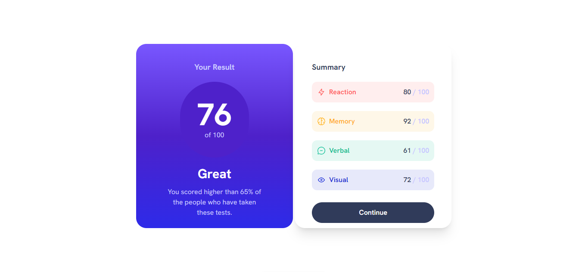
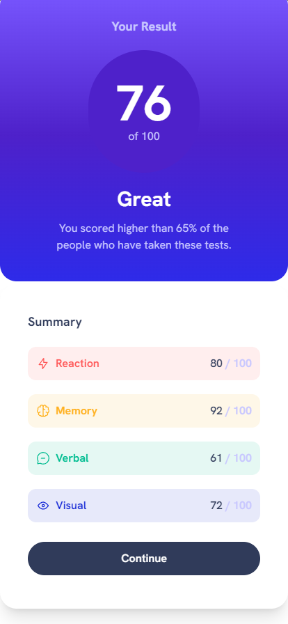

# Frontend Mentor - Results summary component solution

This is a solution to the [Results summary component challenge on Frontend Mentor](https://www.frontendmentor.io/challenges/results-summary-component-CE_K6s0maV). Frontend Mentor challenges help you improve your coding skills by building realistic projects.

## Table of contents

- [Overview](#overview)
  - [The challenge](#the-challenge)
  - [Screenshot](#screenshot)
  - [Links](#links)
- [My process](#my-process)
  - [Built with](#built-with)

## Overview

### The challenge

Users should be able to:

- View the optimal layout for the interface depending on their device's screen size
- See hover and focus states for all interactive elements on the page

### Screenshot

### Links

- Solution URL: [Here](https://www.frontendmentor.io/solutions/result-summary-with-tailwind-css--edaugR6XI)
- Live Site URL: [Here](https://fm-result-summary.vercel.app/)

## My process

### Built with

- [Vite](https://vitejs.dev/)
- [React](https://reactjs.org/)
- [Tailwind CSS](https://tailwindcss.com/)
